# Отчет по лабораторной работе 
## по курсу "Искусственый интеллект"

## Нейросетям для распознавания изображений


### Студенты: 

| ФИО          | Роль в проекте                                | Оценка       |
|--------------|-----------------------------------------------|--------------|
| Палкина А.К. |      |              |

## Результат проверки

| Преподаватель     | Дата         |  Оценка       |
|-------------------|--------------|---------------|
| Сошников Д.В. |         |       |


## Тема работы

Построение распознавательной системы набора символов принадлежности множеству, пересечения, объединения множеств и пустого множества.


## Подготовка данных

Фотографии исходных листов с рукописными символами:
!(report/1.jpg)
!(report/2.jpg)

В связи с получавшимися ужасными фотографиями, было решено отсканировать листы с символами. Для создания видимости нескольких человек, второй лист был заполнен ручкой другого цвета, и более уставшей рукой. Далее, вырезались отдельные изображения 500*500 с помощью приложения lightshot, и из них вырезались отдельные изображения 44*44 (для минимизации разметки, было решено срезать по 3p по краям).

```
for i in range(10):
    for j in range(10):
        cut = im[i*50 + 3:i*50 + step-3, j*50 + 3: j*50 + step-3]
        cv2.imwrite(str(i) + "x" + str(j) + ".jpg", cut)
```


Ссылка на получившийся датасет:  
[set 1](/data/1)  
[set 2](/data/2)  


## Загрузка данных

Загрузка данных происходила с помощью данного кода.
```
def get_size(path, classes):
    size = 0
    for cl in classes:
        size += len(next(os.walk(path + cl))[2])
    ans = [size]
    one_path = path + classes[0] + '/' + next(os.walk(path + classes[0]))[2][0]
    one_im = cv2.imread(one_path)
    ans.extend(list(one_im.shape))
    return tuple(ans)

def img_data_reader(path, classes):
    if path[-1] != '/':
        path += '/'
    size = get_size(path, classes)
    X_cols = np.zeros(size).astype(np.uint8)
    Y_cols = np.zeros((size[0], len(classes))).astype(np.uint8)
    last_bound = 0
    for i in range(len(classes)):
        images = next(os.walk(path + classes[i]))[2]
        for j in range(len(images)):
            X_cols[last_bound + j] = cv2.imread(path + classes[i] + '/' + images[j])
            Y_cols[last_bound + j][i] = 1
        last_bound += len(images)
    return X_cols, Y_cols
```
## Обучение нейросети

### Полносвязная однослойная сеть

```
model_one = Sequential()
model_one.add(Flatten())
model_one.add(Dense(output_dim = len(classes), input_shape=(k_size,), activation='softmax'))
```
Flatten - – слой, преобразующий 2D-данные в 1D-данные для дальнейшей работы, Dense – полносвязный слой.

```
model_one.compile(loss='categorical_crossentropy', optimizer='adam', metrics=['accuracy'])
```

Компиляция модели происходит с использованием categorical_crossentropy в качестве функции потерь и adam в качестве метода оптимизации.

#### Архитектура


#### Результат

Для первого теста (50/50)
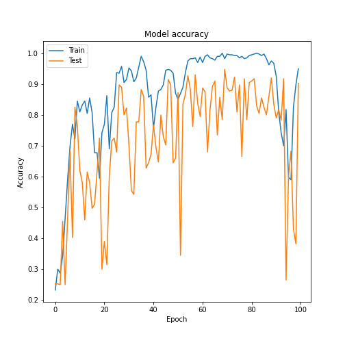
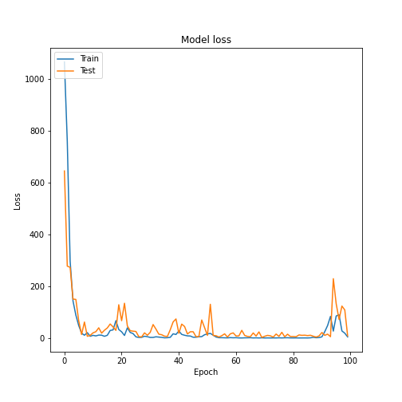

Для второго теста (80/20)
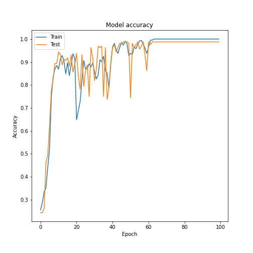
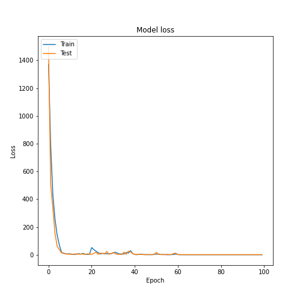

### Полносвязная многослойная сеть

```
inputer_layer = Input(shape = X_train_2.shape[1:])
flat = Flatten(input_shape = X_train_2.shape[1:])(inputer_layer)

layer_1 = Dense(output_dim = hidden_size_2, input_shape=(4,), kernel_initializer = 'random_uniform', activation = 'relu')(flat)

layer_2 = Dense(output_dim = hidden_size_3, kernel_initializer = 'random_uniform', activation = 'relu')(layer_1)

layer_3 = Dense(output_dim = hidden_size_3, kernel_initializer = 'random_uniform', activation = 'relu')(layer_2)

outputer_layer = Dense(output_dim = 4, activation = 'softmax')(layer_2)
```
Первый слой сети - входное изображение декларируется с помощью класса Input, далее Flatten для форматирования данных. Далее нейросеть содержит три четыре полносвязных слоя Dense.

#### Архитектура

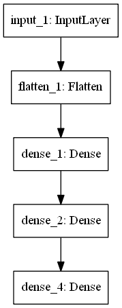

#### Результат

Для первого теста (50/50)
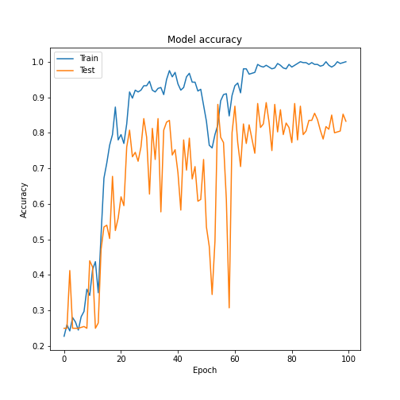
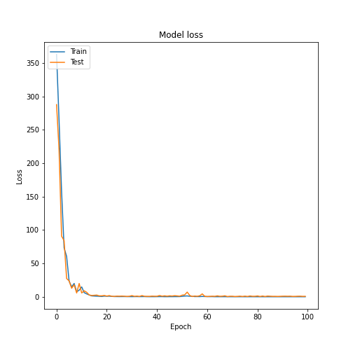

Для второго теста (80/20)
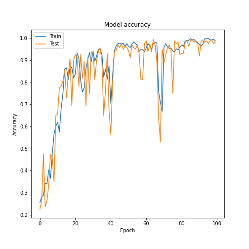
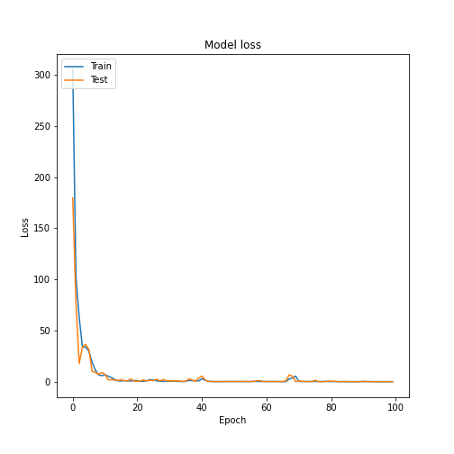


### Свёрточная сеть

```
inpt = Input(shape = X_train.shape[1:])

conv_1 = Conv2D(depth_1, kernel_size=k_size, activation="relu", kernel_initializer="he_uniform")(inpt)

pool_1 = MaxPooling2D(pool_size=(p_size, p_size))(conv_1)

conv_2 = Conv2D(depth_2, kernel_size=k_size, activation="relu", kernel_initializer="he_uniform")(pool_1)

pool_2 = MaxPooling2D(pool_size=(p_size, p_size))(conv_2)

conv_3 = Conv2D(depth_3, kernel_size=k_size, activation="relu", kernel_initializer="he_uniform")(pool_2)


flat = Flatten()(conv_2) # makes 1D

drop_1 = Dropout(drop_p)(flat)
hid_1 = Dense(h_size, kernel_initializer="he_uniform", activation='relu')(drop_1)
hid_1 = BatchNormalization(axis=1)(hid_1)
 

drop_2 = Dropout(drop_p)(hid_1)
outpt = Dense(4, kernel_initializer="glorot_uniform", activation='softmax')(drop_2)
```
Свёрточная нейронная сеть состоит из 2-ух связанных частей: комбинации свёрточных и субдискредитирующих слоев, которые работают с плоским изображением и классической полносвязанной нейронной сети, которорая выдает результат.
Первый слой сети - входное изображение декларируется с помощью класса Input, далее три скрытых полносвязных слоя. Функция активации на скрытых слоях relu, так как ее практическое примение показывает хорошие результаты и обеспечивает большую скорость обучения модели. Слой Dropout был добавлен для уменьшение коллизий и слой BatchNormalization для регуляризации параметров.

#### Архитектура

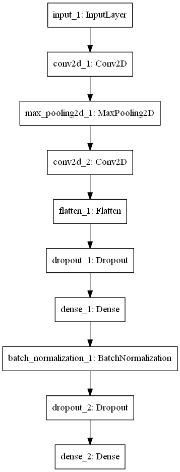

#### Результат

Для первого теста (50/50)
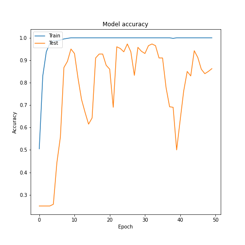
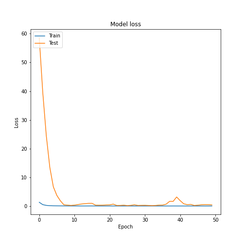

Для второго теста (80/20)
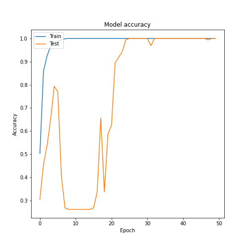
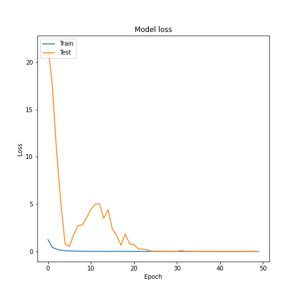


## Выводы

В процессе работы я изучила применение полносвязной нейронной сети и сверточной нейронной сети, столкнулась с проблемой оцифровки и разбиения изображений и построением и обучением нейронных сетей.
Результат при тренировке на тесте 80/20, как и ожидалось, превзошел результат от (50/50). Думаю, это можно объяснить тем, что в первом случае модель имела больше данных для обучения и образцы изображений обоих датасетов. 
В ходе данной лабораторной возникли трудности с установкой и совместимостью различных библиотек, что дополнительно научило меня пользоваться созданием среды в anaconda.
